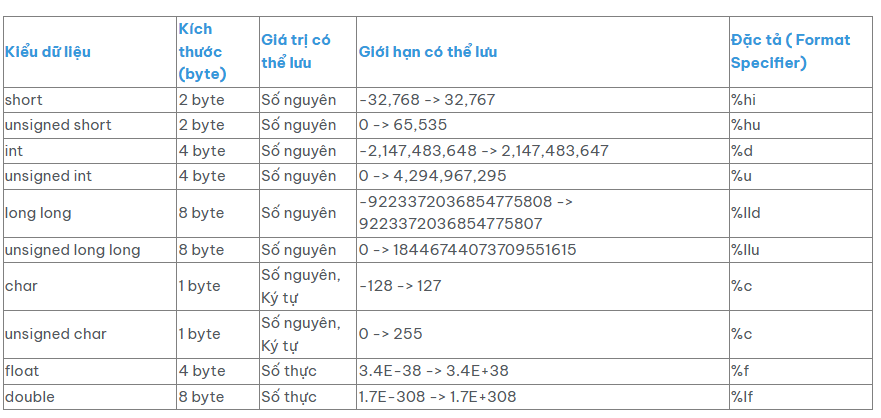

# Các loại ngôn ngữ lập trình
    - Ngôn ngữ lập trình biên dịch: Muốn chạy được code thì phải thực hiện biên dịch ra ngôn ngữ máy (C/C++ , Java, ...)
    - Ngôn ngữ lập trình thông dịch: Không cần phải biên dịch ra ngôn ngữ máy (PHP, Python, Javascript, ...)


# Các lưu ý
    - Sau mỗi câu lệnh phải có dấu ;
    - Dùng kí tự \n để xuống dòng trong câu lệnh printf();

# Cấu trúc chương trình cơ bản

```c
#include <stdio.h>

int main() {
    printf("Hello, world!\n");
    return 0;
}
```

# Các kiểu dữ liệu cơ bản trong C

| Kiểu     | Mô tả                 | Kích thước phổ biến |Đặc tả|
| -------- | --------------------- | ------------------- |------|
| `int`    | Số nguyên             | 2 hoặc 4 byte       |%d    |
| `char`   | Ký tự                 | 1 byte              |%s    |
| `float`  | Số thực               | 4 byte              |%f    |
| `double` | Số thực               | 8 byte              |%lf   |


# Các kiểu dữ liệu chính trong C




# Khai báo biến, kiểu dữ liệu, toán tử


```c
#include <stdio.h>

int main() {
    int a = 5, b = 10;
    float c = 3.14;
    int sum = a + b;
    printf("Tổng a + b = %d\n", sum);
    printf("Giá trị c = %.2f\n", c);
    return 0;
}
```

# Nhập giá trị truyền vào

Để nhập giá trị truyền vào, ta sử dụng hàm <b>scanf("[Đặc tả]", [tên biến])</b>
VD: 
```c
int a;
scanf("%d", &a);
```


có thể nhập được nhiều biến cùng 1 lúc <b>scanf("[Đặc tả 1] [Đặc tả 2]", [tên biến 1], [tên biến 2])</b>
VD: 
```c
int a,b;
scanf("%d %d", &a, &b);
```

```c
#include <stdio.h>

int main() {
    int a,b;
    printf("nhap gia tri a=");
    // nhap vao gia tri a
    scanf("%d", &a);
    printf("nhap gia tri b=");
    //nhap vao gia tri b
    scanf("%d", &b);

    // tinh tong
    int c = a+b;

    printf("Tong la: %d", c);
    return 0;
}

```

# Các phép toán so sánh trong câu điều kiện

```c

// Phép so sánh lớn hơn
if (a > b) {...}

// Phép so sánh nhỏ hơn
if (a < b) {...}

// Phép so sánh lớn hơn hoặc bằng
if (a >= b) {...}

// Phép so sánh nhỏ hơn hoặc bằng
if (a <= b) {...}

// Phép so sánh bằng
if ( a == b) {...}

//Phép so khác
if ( a != b) {..}


```


# Câu điều kiện trong C

```c
#include <stdio.h>

int main() {
    int x;
    printf("Nhập số nguyên x: ");
    scanf("%d", &x);

    // if-else
    if (x > 0)
        printf("x là số dương\n");
    else if (x < 0)
        printf("x là số âm\n");
    else
        printf("x là số 0\n");

    // switch
    switch (x) {
        case 1:
            printf("x là 1\n");
            break;
        case 2:
            printf("x là 2\n");
            break;
        default:
            printf("x không phải 1 hoặc 2\n");
    }
    return 0;
}
```


# Vòng lặp trong C

```c
#include <stdio.h>

int main() {
    int i;
    printf("In các số từ 1 đến 5 bằng for:\n");
    for (i = 1; i <= 5; i++) {
        printf("%d ", i);
    }
    printf("\n");

    printf("In các số từ 1 đến 5 bằng while:\n");
    i = 1;
    while (i <= 5) {
        printf("%d ", i);
        i++;
    }
    printf("\n");
    return 0;
}
```